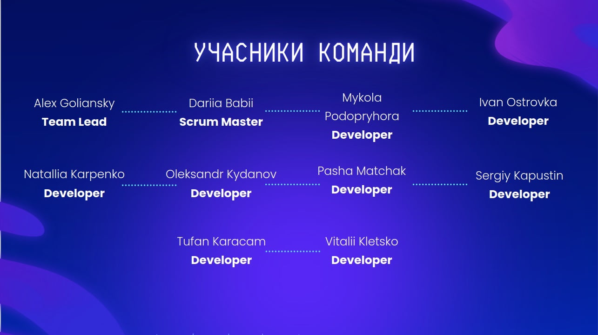

# English Excellence

## Project Structure

The website is structured into the following sections:

- **Header**
- **Hero**
- **About us**
- **Our lessons**
- **Proposal to leave an application**
- **Our teachers**
- **Leave an application**
- **Reviews**
- **Footer**

## Development team

- [Alex Goliansky](https://github.com/megabytos) - Team Lead (repository, PR-reviewing, bug fixing)
- [Dariia Babii](https://github.com/DariiaBabii) - Scrum Master (Our lessons)
- [Mykola Podopryhora](https://github.com/nickunderhill) - Header
- [Tufan Karacam](https://github.com/tufankaracam) - Hero
- [Oleksandr Kydanov](https://github.com/saniola) - About us
- [Vitalii Kletsko](https://github.com/vkletsko) - Proposal to leave an application
- [Natallia Karpenko](https://github.com/Netaly79) - Our teachers
- [Pasha Matchak](https://github.com/pavlomatchak) - Leave an application
- [Ivan Ostrovka](https://github.com/ZorAnderius) - Reviews
- [Sergiy Kapustin](https://github.com/sergiy-ka) - Footer

## Presentation

## Figma Design File

[Figma Design](https://www.figma.com/file/MrdZUmIfeT1bKd8u5GWLRt/English-Excellence-2.0?type=design&node-id=0%3A1&mode=design&t=ABsxLoZAXhbRJT6P-1)

## Install project

- Install dependencies: npm install
- Run the development server and preview the project locally: npm run dev